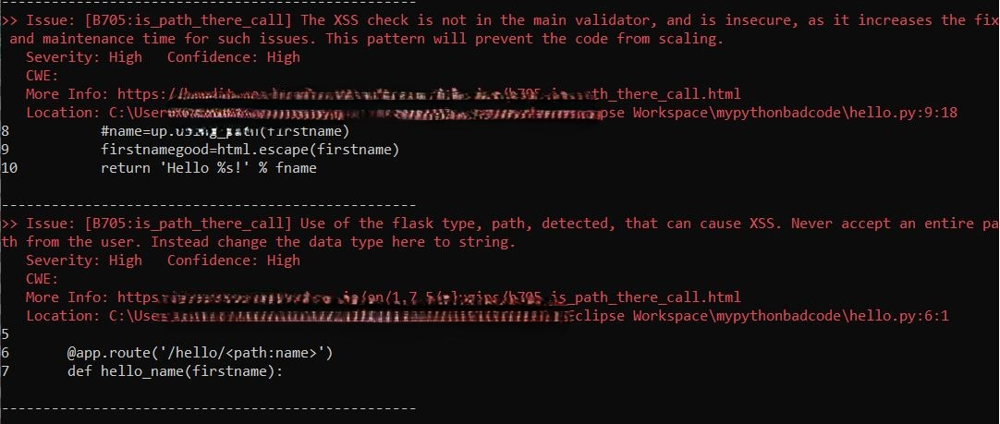

# Bandit plugin experiment for the game of secure software development

## Name
banditrule 

## Pre-requisites
- Install ()

## Project status
This is a work-in-progress as of Feb 2025, with my PhD expected to finish around the end of 2025. The experimental setup is expected to be stable by March 2025, with a paper planned to be published around mid-2025. Updates will be made here as needed.

## Description
This work is an experimental setup for the theoretical concepts of my PhD. Bandit is a SAST (Static Application Security Testing) scanning tool, which is aimed at Python source code. The way a Bandit plugin works - you need to:
1. Have a setup.py, which tells Python/Bandit about which method has the implementation of the plugin
2. The plugin itself, which in our case is implemented in using_path_type.py

The aim of my research is to have the work sit in a compiler like application like Bandit, to apply Game Theory to existing code blocks, figure out incompatible maths that is going to impact co-operation, re-design the game to foster co-operation, modify the source, and check it in into a separate branch (we call this entire activity as finx, as opposed to most SAST tools, which only find). This branch is hoped to be seen as a candidate to be merged into the master branch. There is a tool (https://www.lucentsky.com/en), which seems to do something similar to how we finx, which, however, is proprietary, so we have no way of knowing how similar it is to this one/whether it uses a similar Game Theoretic approach etc. The logic in this project contains this idea in a very rudimentary implementation. We are testing this project via the intentionally bad code we have written in Python, (will be published soon). The general flow of the idea in action would be:

1. Install Bandit, and this plugin
2. Download the example code
3. Run Bandit against it
4. Once Bandit runs, the plugin logic will kick in
5. Currently, the plugin checks for the usage of an output variable of a Flask webapp, and ensures that it's not of the type Path. The plugin also checks if the low-level design is broken, mainly by ensuring that the defensive code is in an expected file, failing which we are staring at potentially bad defensive code implementation by somebody else, and similar security+maintenance nightmares.

Deeper dive into our plugin (T.B.C description/screenshots to say which point is implemented in which section of using_path_type.py):
1. Plug into the AST that Bandit is working through
2. Build our own tree from it, which represents some (explained deeper in some appropriate comment in each .py file) insecure code pattern
3. Like in our paper 1, we analyze this tree/graph (TBC tree or graph. Also to take care - potential np complete/np hard problems), and see if it will end up in the dev and security community not-cooperating with each other. Our plugin is an implementation of our first paper (https://ieeexplore.ieee.org/document/10051798), wherein, we use this tree as an input to the VCG designing logic
4. The VCG design logic will re-design the game, and mainly, provide the payoff values for our game
5. We then analyze the re-designed game, and decide if we finx or not.
6. The decision making will involve a threshold design, which will derive from the laws of conservation of energy/matter. This will serve as the basis for the probabilities that we need for the Bayesian game in the end.
7. Finx, operationally for us, means the act of re-writing the insecure code with a secure version of it, and creating a separate branch for it, and checking in the security branch. The re-written portion may involve the secure source itself and/or some design artifact with secure settings/values, which developers are best suited to integrate in their source (missing security properties which they can now get from the security branch). The idea being that this hopefully provides an initial impact analysis of the change, which can help engineers in deciding whether to merge the branch or not. So, the act of securing code, from a developer's perspective, can be as lightweight as ensuring that the security branch doesn't break their feature/development branch (instead of them having to worry about every line of the defensive code to write). In principle, this is similar to efforts in automated program repair (https://program-repair.org/), each solving it's own identified issue (what we identified can be seen in the paper linked above).

P.S. A SAST tool may not be the only place to implement this idea, as this logic could also make sense within a compiler itself, if one wants to mainstream security rules to be as strict as any language's grammar. This logic could also go into a plugin for a CI/CD tool like Jenkins or Bamboo, depending on which security rule one wants to check, before deploying the code. It's also possible to integrate this logic into low-level languages, and even for hardware problems that require optimization/operations research concepts - there's a whole area tying games with optimization problems.

## Example usage
- Checkout this code base, and note the location of the root dir
- Run the command "pip install "<your-workspace>\banditrule"" (the full location from the above step). This will install the bandit plugin, and will make it ready to be picked up by bandit.
- Once you download the sample code in (TBD), you would run the following command:

bandit -r -t B705 -x "<your-workspace>\mypythonbadcode\__pycache__","<your-workspace>\mypythonbadcode\venv" "<your-workspace>\mypythonbadcode"

The above command runs bandit on this test code base, with our plugin (numbered 705), excluding certain unnecessary files. The output is expected to be a new branch, with the secure code, given the logic in our bandit plugin.

A sample output, with the plugin's findings, is below:

One test case checked was if the defensive code is in an unexpected class, or not in the file marked for the defensive code. In such case, if the defensive code is used in many places one by one, the below graph explains the ensuing cacophony. The vision is to have such common code written into the common file, instead of individual files, from where it will be deleted. A graph like this would be the input to the game we will analyze. The idea is that such a graph risks co-operation breakdown, if the dev has to add the defensive code in all their locations. The solution offered will be a common file, maintained by a security champion/engineer, and the devs simply call the common file for sanitization, instead of having it everywhere.

## Useful references
Bandit in general: https://github.com/PyCQA/bandit/tree/main
An advice on installing a Bandit plugin, which is what we have in our setup.py: https://github.com/PyCQA/bandit/issues/214
A neat Bandit plugin that's a SARIF formatter, which served as an inspiration around Bandit plugins: https://github.com/microsoft/bandit-sarif-formatter/blob/main/bandit_sarif_formatter/formatter.py
CVE categories accounting, which will be factored into the base probabilities that our game needs: https://www.cvedetails.com/vulnerabilities-by-types.php
A thought-provoking paper from the original literature review, which could have a role to play in my work/vice-versa: https://ieeexplore.ieee.org/abstract/document/7163211
A paper that could be useful in future: https://papers.academic-conferences.org/index.php/eccws/article/view/1154
A book that could be useful in the future: https://www.oreilly.com/library/view/secure-programming-with/9780321424778/ch01.html
Inspiration on how we generate call graphs: https://cerfacs.fr/coop/pycallgraph
Useful guide in spinning up a test Flask app: https://www.digitalocean.com/community/tutorials/how-to-make-a-web-application-using-flask-in-python-3
More on Flask apps: https://www.geeksforgeeks.org/flask-app-routing/?ref=lbp
Bandit plugin testing: https://bandit.readthedocs.io/en/latest/plugins/index.html#writing-tests
Some initial reading around modifying the source that an AST represents: https://stackoverflow.com/questions/768634/parse-a-py-file-read-the-ast-modify-it-then-write-back-the-modified-source-c
An interesting unparser of something that's parsed: https://svn.python.org/projects/python/trunk/Demo/parser/unparse.py
More unparsing discussions: https://stackoverflow.com/questions/3774162/given-an-ast-is-there-a-working-library-for-getting-the-source
More AST unparsing: https://astunparse.readthedocs.io/en/latest/index.html
Plugin types based on Abstract Grammar?: https://docs.python.org/3/library/ast.html

## Authors and acknowledgment
Show your appreciation to those who have contributed to the project.

## License
Apache-2.0 license
